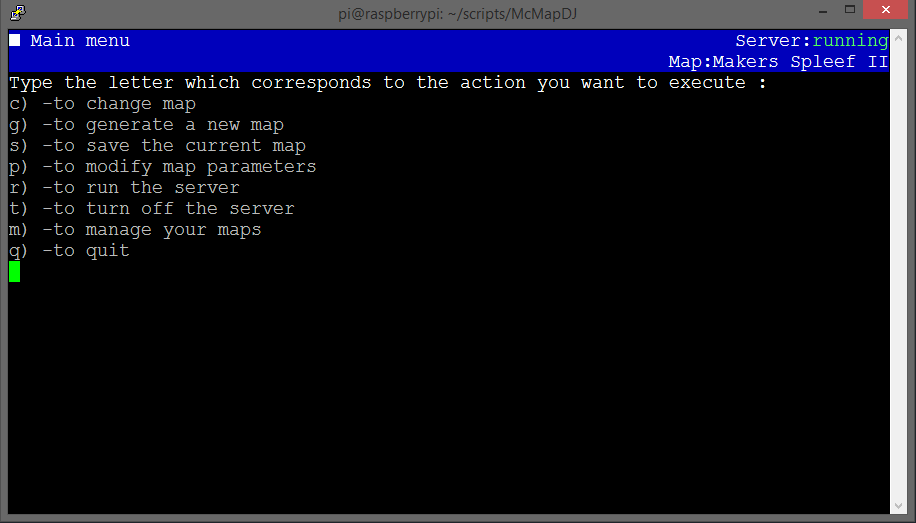
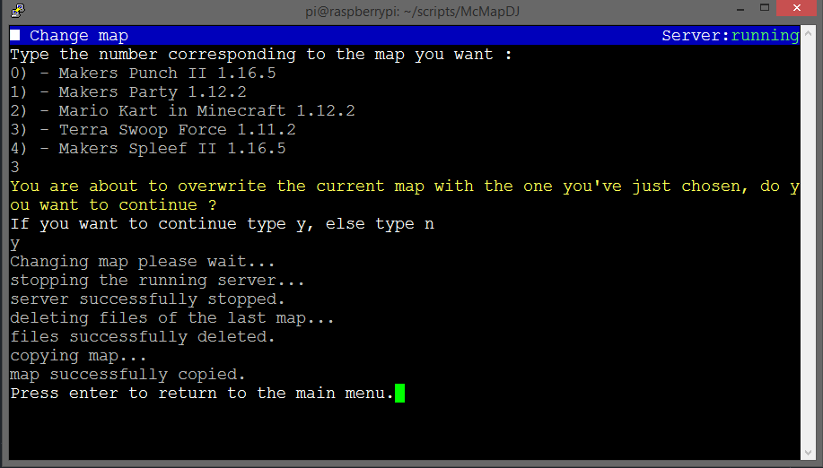
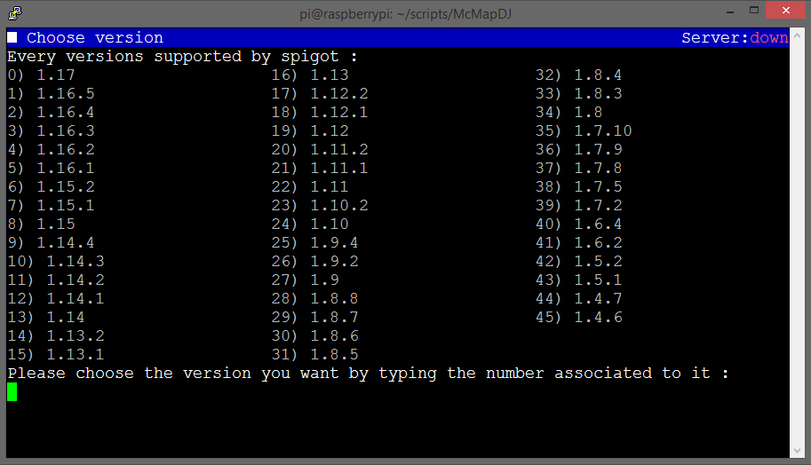
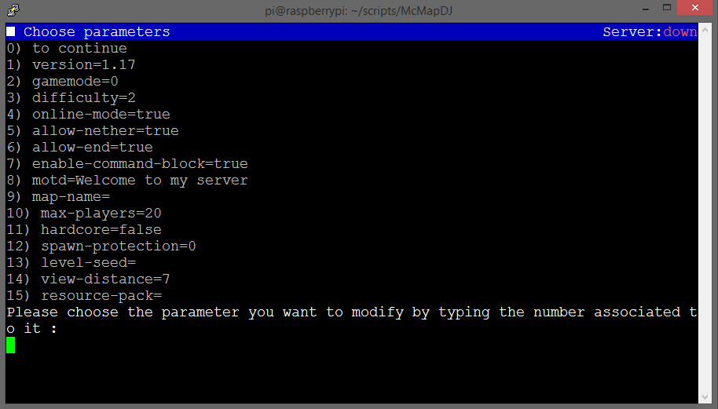
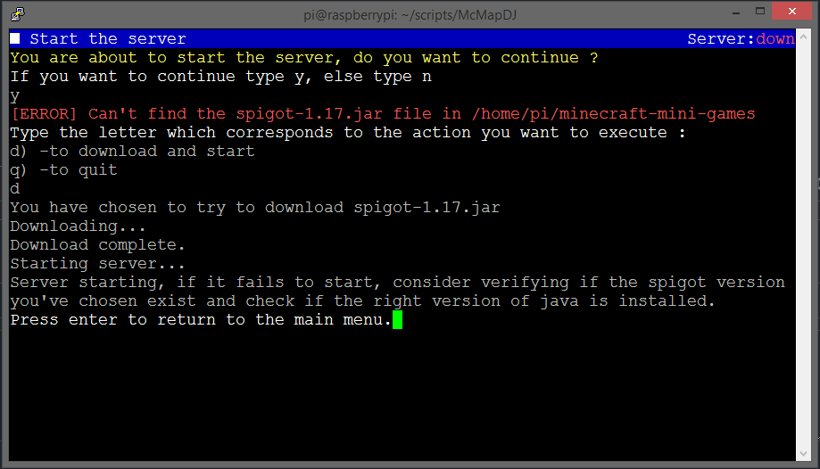

# McMapDJ
A simple terminal app to manage quickly your minecraft maps on your spigot server

### What's the point of using McMapDJ ?

Running your own vanilla minecraft server is cool, but managing it can be tedious sometimes...  
Especialy when it come to change the map multiple times a day.  
Close the server, make a save, upload the new map, (rename some directories), start the server at the right version and manually download the spigot.jar file if the wanted version is missing...  
Already a pain, but it is even more when your friends keep asking you if you are done while you are doing it.  

It wouldn't be nice if it was possible to set or generate a map quikly ? If the server would automaticaly start at the right version ? Or if the spigot.jar would download automaticaly if needed ?

Well it's exactly what McMapDJ doese !

### How do i set it up ?

#### 1) Requirements
You must have [Python](https://www.python.org/) and [screen](https://linuxize.com/post/how-to-use-linux-screen/) installed on your server.

#### 2) Download

Theoretically you can download [McMapDJ](https://github.com/TrOllOchamO/McMapDJ) in any directory on your server and it should work fine, though i only tested it when the file resided directly in my linux user which hosts the server.

#### 3) Initialize

Once downloaded you must edit the ``param_McMapDJ.txt`` text file, add every informations requested. (You can check the [param_McMapDJ_example.txt](./param_McMapDJ_example.txt).)

You are done, You can alredy start using McMapDJ by running ``McMapDJ.py``.

#### 4) Add a map

To add a map to the saves (in order to manage it with McMapDJ) you must copying it like this :
```
McMapDJ
 └-Maps
    └-YOUR_SAVE_NAME
       └-YOUR_MAP_DIRECTORY_RENAMED_IN_world
       └-YOUR_server.properties_FILE
```
My current ``Maps`` directory looks something like this :
```
McMapDJ
 └-Maps
    └-Terra Swoop Force 1.11.2
       └-world
       └-server.properties
    └-Makers Spleef II 1.16.5
       └-world
       └-server.properties
    └-Survival world
       └-world
       └-world_nether
       └-world_the_end
       └-server.properties
       └-plugins
```


### How doese it looks like ?

#### The menu :
[](./Lib/images/menu.png)
#### Change a map :
[](./Lib/images/change_map.png)
#### Choosing a version :
[](./Lib/images/choosing_version.png)
#### Choosing parameters :
[](./Lib/images/choosing_parameters.png)
#### Starting the server :
[](./Lib/images/start_server.png)
